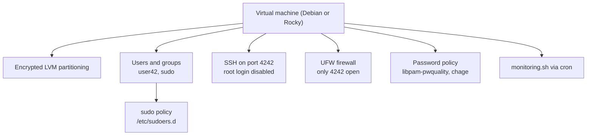

# Born2beRoot

[← Back to repository overview](../README.md) · [Glossary](../GLOSSARY.md)

A system administration project: build and harden a virtual machine under strict rules —
no graphical interface, encrypted LVM partitioning, a restrictive `sudo` policy, a password
policy, a firewall and a monitoring script. The directory holds the subject and the study
notes ([`Born2beRoot/README.md`](./README.md)); the deliverable itself is the
VM's `signature.txt`.

## Scope

## Concepts

**Virtualization.** A hypervisor creates and manages virtual machines on a host. Type 1
(bare metal) runs directly on the hardware; type 2 runs on top of a host operating system
(VirtualBox, UTM).

**Debian vs. Rocky.** Debian is community driven, flexible and well suited to learning;
Rocky Linux is an enterprise distribution with long-term support, SELinux and a focus on
stability for production systems.

**Partitions and LVM.** A partition is a logical division of a physical disk. LVM adds a
layer of indirection:

| Layer | Meaning |
| ----- | ------- |
| Physical Volume (PV) | A raw device or partition, e.g. `/dev/sda1` |
| Volume Group (VG) | A pool combining one or more PVs |
| Logical Volume (LV) | A resizable virtual partition carved out of a VG (`/`, `/home`, `swap`, …) |

Because LVs are not tied to contiguous disk space, they can be resized or snapshotted
without repartitioning.

**AppArmor / SELinux.** Mandatory access control frameworks that confine what a program is
allowed to do, beyond traditional UNIX permissions.

**sudo.** Configured through `/etc/sudoers.d/` with the required constraints: at most three
authentication attempts, a custom error message, input and output logging to
`/var/log/sudo/`, TTY requirement, and a restricted `secure_path`.

**Password policy.** Enforced with `libpam-pwquality` (minimum length, character classes,
no more than three consecutive identical characters, must not contain the user name) and
`chage` (expiry after 30 days, minimum 2 days between changes, 7-day warning).

**SSH.** `sshd` listens on port `4242` with `PermitRootLogin no`, so administration is done
through an unprivileged account that must escalate via `sudo`.

**UFW.** The firewall denies incoming traffic by default and allows only port `4242`.

**monitoring.sh.** A shell script broadcast to all terminals every 10 minutes by `cron`,
reporting architecture and kernel, physical and virtual CPU counts, memory and disk usage,
CPU load, last boot time, whether LVM is active, active TCP connections, logged-in users,
the IPv4 and MAC addresses, and the number of `sudo` commands executed.

The upstream notes in [`Born2beRoot/README.md`](./README.md) collect the
reference articles and videos used for each of these topics, plus the defence questions.
