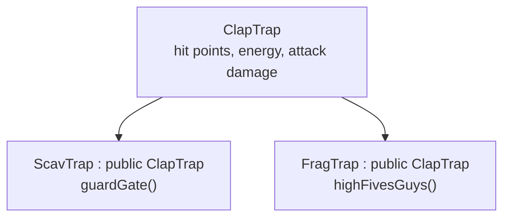
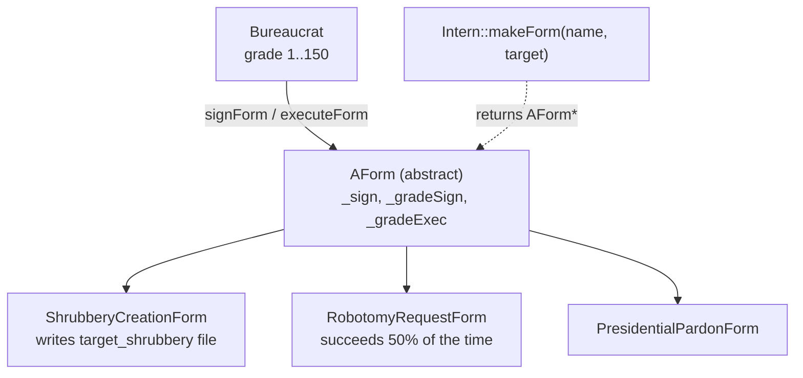
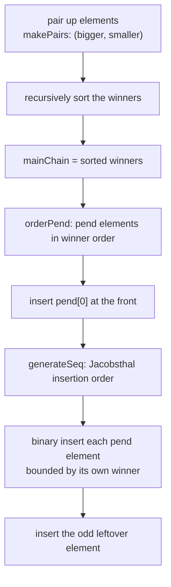

# CPP Modules

[← Back to repository overview](../README.md) · [Glossary](../GLOSSARY.md)

A progression of C++98 exercises introducing object-oriented programming to students coming
from C. Every exercise is a standalone directory with its own `Makefile`; the compiler
flags are `-Wall -Wextra -Werror -std=c++98`.

```sh
cd CPP-Modules/CPP-Module-02/ex00 && make && ./out
```

Most exercises build a binary named `out`; the exceptions are module 00 (`megaphone`,
`phonebook`) and module 09 (`btc`, `RPN`, `PmergeMe`).

## Module map


## Module 00 — [`CPP-Module-00`](./CPP-Module-00)

| Exercise | Content |
| -------- | ------- |
| [`ex00`](./CPP-Module-00/ex00) | `megaphone.cpp` — uppercase every argument, first contact with `std::cout` and `std::string` |
| [`ex01`](./CPP-Module-00/ex01) | Phonebook: `Contact` and `PhoneBook` classes, fixed-size storage of 8 contacts, formatted column output, `ADD` / `SEARCH` / `EXIT` command loop |

Concepts: classes vs. structs, member functions, encapsulation, `std::string`, stream
manipulators (`std::setw`).

## Module 01 — [`CPP-Module-01`](./CPP-Module-01)

| Exercise | Content |
| -------- | ------- |
| [`ex00`](./CPP-Module-01/ex00) | `Zombie` — heap (`newZombie`) vs. stack (`randomChump`) allocation |
| [`ex01`](./CPP-Module-01/ex01) | `zombieHorde` — allocating an array of objects with `new[]` |
| [`ex02`](./CPP-Module-01/ex02) | "Brain" — addresses, pointers and references to the same variable |
| [`ex03`](./CPP-Module-01/ex03) | `HumanA` / `HumanB` with a `Weapon` — reference member (always armed) vs. pointer member (optional) |
| [`ex04`](./CPP-Module-01/ex04) | Sed-like file filter using `std::ifstream` / `std::ofstream` |
| [`ex05`](./CPP-Module-01/ex05) | `Harl` — pointers to member functions replacing an if/else chain |
| [`ex06`](./CPP-Module-01/ex06) | `Harl` filter — the same dispatch driven by a `switch` with fall-through |

## Module 02 — [`CPP-Module-02`](./CPP-Module-02)

The `Fixed` fixed-point number class, built up over three exercises
([`Fixed.hpp`](./CPP-Module-02/ex00/Fixed.hpp)):

```cpp
class Fixed
{
    private:
        int fpoint_value;
        static const int fbits = 8;
    public:
        Fixed();
        Fixed(const Fixed &Cpy);
        Fixed& operator=(const Fixed &other);
        ~Fixed();
        int  getRawBits(void) const;
        void setRawBits(int const raw);
};
```

- `ex00` — the orthodox canonical form: default constructor, copy constructor, copy
  assignment operator, destructor.
- `ex01` — `int` and `float` constructors, `toInt()` / `toFloat()` conversions and the
  `operator<<` overload for `std::ostream`.
- `ex02` — comparison, arithmetic and increment/decrement operators plus the static
  `min` / `max` helpers.

The value is stored as an integer scaled by `1 << 8`, which is why conversions are shifts
and divisions by `256`.

## Module 03 — [`CPP-Module-03`](./CPP-Module-03)



Exercises `ex00`–`ex02` introduce single inheritance, constructor/destructor chaining
order, protected members and member overriding. `ScavTrap` and `FragTrap` each override
`attack` and add their own behaviour while reusing `ClapTrap`'s state.

## Module 04 — [`CPP-Module-04`](./CPP-Module-04)

| Exercise | Content |
| -------- | ------- |
| [`ex00`](./CPP-Module-04/ex00) | `Animal` / `Dog` / `Cat` with `virtual void makeSound()`, contrasted with `WrongAnimal` / `WrongCat` which omit `virtual` |
| [`ex01`](./CPP-Module-04/ex01) | `Brain` member — deep copy in the copy constructor and assignment operator, plus a virtual destructor |
| [`ex02`](./CPP-Module-04/ex02) | `AbsAnimal` — abstract base class with a pure virtual `makeSound() const = 0`, which cannot be instantiated |
| [`ex03`](./CPP-Module-04/ex03) | Interfaces `ICharacter` / `IMateriaSource`, abstract `AMateria` with `clone()`, concrete `Ice` and `Cure`, inventory management in `Character` and `MateriaSource` |

Key takeaways: a base class with virtual functions needs a virtual destructor; deep copies
are mandatory when a class owns heap memory; and `clone()` is the C++98 way to duplicate a
polymorphic object without knowing its concrete type.

## Module 05 — [`CPP-Module-05`](./CPP-Module-05)

Exceptions, built around a bureaucracy simulation.

| Exercise | Content |
| -------- | ------- |
| [`ex00`](./CPP-Module-05/ex00) | `Bureaucrat` with a `const std::string _name` and a grade in `[1, 150]`, where 1 is the highest; `increment()` lowers the number and `decrement()` raises it, both throwing the nested `GradeTooHighException` / `GradeTooLowException` (derived from `std::exception`) at the bounds |
| [`ex01`](./CPP-Module-05/ex01) | `Form` — signable only by a bureaucrat whose grade is high enough; `beSigned` throws instead of returning an error code |
| [`ex02`](./CPP-Module-05/ex02) | `AForm` becomes abstract with three concrete forms: `ShrubberyCreationForm`, `RobotomyRequestForm`, `PresidentialPardonForm` |
| [`ex03`](./CPP-Module-05/ex03) | `Intern::makeForm(name, target)` — a factory returning `AForm*` chosen by name, without an if/else chain in the caller |

The interesting design point is in [`AForm.hpp`](./CPP-Module-05/ex02/AForm.hpp): the public
`execute` runs the grade and signature checks, then delegates to a **protected pure
virtual** hook, so derived forms cannot bypass the validation.

```cpp
class AForm
{
    public:
        void execute(const Bureaucrat &executor) const;   /* checks, then calls the hook */
    protected:
        virtual void executeAction(const Bureaucrat &executor) const = 0;
};
```



Both exception classes are nested inside their owner and override
`const char* what() const throw()` — the C++98 signature, with the historical exception
specification.

## Module 06 — [`CPP-Module-06`](./CPP-Module-06)

Type conversion and the four C++ casts.

| Exercise | Content |
| -------- | ------- |
| [`ex00`](./CPP-Module-06/ex00) | `ScalarConverter::converter(const std::string&)` — detects the literal type and prints the `char` / `int` / `float` / `double` representations |
| [`ex01`](./CPP-Module-06/ex01) | `Serializer` — `uintptr_t serialize(Data*)` and `Data* deserialize(uintptr_t)` using `reinterpret_cast` |
| [`ex02`](./CPP-Module-06/ex02) | `Base` / `A` / `B` / `C` — runtime type identification with `dynamic_cast` |

`ScalarConverter` is a non-instantiable utility class: the constructors, copy assignment
and destructor are private, and the only public member is `static void converter(...)`.
Input is classified by an internal `enum Type { CHAR, INT, FLOAT, DOUBLE, PSEUDO, INVALID }`;
the pseudo-literals `nan`, `nanf`, `+inf`, `-inf`, `+inff`, `-inff` are handled separately
and produce `impossible` for the integral types. Out-of-range or non-displayable values
also print `impossible` / `Non displayable`.

`ex02` shows both forms of `dynamic_cast`:

```cpp
identify(Base *p);   /* pointer form: returns NULL on failure */
identify(Base &p);   /* reference form: throws std::bad_cast, caught per candidate type */
```

| Cast | Used for |
| ---- | -------- |
| `static_cast` | Related types, explicit numeric conversions |
| `reinterpret_cast` | Pointer ↔ integer round-trip in `Serializer` |
| `dynamic_cast` | Downcasting a polymorphic pointer/reference in `ex02` |
| `const_cast` | Removing constness (not required by these exercises) |

## Module 07 — [`CPP-Module-07`](./CPP-Module-07)

Function and class templates. All three exercises are header-only, since C++98 templates
must be visible at the point of instantiation.

| Exercise | Content |
| -------- | ------- |
| [`ex00`](./CPP-Module-07/ex00) | [`whatever.hpp`](./CPP-Module-07/ex00/whatever.hpp) — `swap`, `min`, `max` as function templates returning `T const &` |
| [`ex01`](./CPP-Module-07/ex01) | [`iter.hpp`](./CPP-Module-07/ex01/iter.hpp) — `iter(T *array, std::size_t length, Func func)`, the callable being a second template parameter so function pointers and functors both work |
| [`ex02`](./CPP-Module-07/ex02) | [`Array.hpp`](./CPP-Module-07/ex02/Array.hpp) — a bounds-checked dynamic array class template |

`Array<T>` allocates with `new T[n]()` so elements are value-initialised, implements the
canonical form with a deep copy, and throws `std::out_of_range` from both the mutable and
the `const` `operator[]`:

```cpp
template <typename T>
T &Array<T>::operator[](unsigned int i)
{
    if (i >= _size)
        throw std::out_of_range("Index out of range");
    return arr[i];
}
```

## Module 08 — [`CPP-Module-08`](./CPP-Module-08)

Templated containers, iterators and algorithms.

| Exercise | Content |
| -------- | ------- |
| [`ex00`](./CPP-Module-08/ex00) | `easyfind(T &container, int val)` — wraps `std::find`, throws a `NotFound` exception when the value is absent |
| [`ex01`](./CPP-Module-08/ex01) | `Span` — stores at most `maxSize` integers and reports `shortestSpan()` / `longestSpan()` |
| [`ex02`](./CPP-Module-08/ex02) | `MutantStack` — `std::stack` made iterable |

`easyfind` returns `typename T::iterator`; the `typename` keyword is required because the
name is a dependent type. `Span::addRange` is a member template taking an iterator pair,
so a whole range can be filled in one call:

```cpp
template <typename it>
void Span::addRange(it first, it last)
{
    if (data.size() + std::distance(first, last) > maxSize)
        throw FullException();
    data.insert(data.end(), first, last);
}
```

`MutantStack` inherits publicly from `std::stack<T>` and exposes the protected member `c`
(the underlying container) as iterators:

```cpp
typedef typename std::stack<T>::container_type::iterator iterator;
iterator begin() { return this->c.begin(); }
iterator end()   { return this->c.end(); }
```

## Module 09 — [`CPP-Module-09`](./CPP-Module-09)

Using the STL to solve three concrete problems; the point of the module is choosing the
right container.

| Exercise | Program | Container | Problem |
| -------- | ------- | --------- | ------- |
| [`ex00`](./CPP-Module-09/ex00) | `btc` | `std::map<std::string, double>` | Value a bitcoin amount at the exchange rate of a given date |
| [`ex01`](./CPP-Module-09/ex01) | `RPN` | `std::stack<int>` | Evaluate a reverse-polish expression |
| [`ex02`](./CPP-Module-09/ex02) | `PmergeMe` | `std::vector<int>` and `std::deque<int>` | Ford–Johnson merge-insertion sort, timed on both containers |

### ex00 — BitcoinExchange

```sh
cd CPP-Module-09/ex00 && make && ./btc input.txt
```

`GetDB` loads [`data.csv`](./CPP-Module-09/ex00/data.csv) (`date,exchange_rate`) into a
`std::map`, whose ordering is what makes the lookup work: for a date with no exact entry,
`lower_bound` is walked back one step to get the closest earlier date.

```cpp
std::map<std::string, double>::const_iterator it = data.lower_bound(date);
if ((it == data.end() || it->first != date) && it != data.begin())
    --it;
```

Input lines are `date | value` ([`input.txt`](./CPP-Module-09/ex00/input.txt)); malformed
dates, negative values and values above `1000` are reported per line with
`Error: bad input => …`, `Error: not a positive number.` and `Error: too large a number.`
without aborting the run.

### ex01 — RPN

`RPN::evaluate` pushes single-digit operands on a `std::stack<int>` and, on `+`, `-`, `*`
or `/`, pops two operands and pushes the result. Errors — unknown token, missing operand,
division by zero — are thrown as `std::runtime_error`. Note the pop order: the first value
popped is the right-hand operand.

### ex02 — PmergeMe

Merge-insertion (Ford–Johnson) sort, run on a `std::vector` and a `std::deque` so the
timings can be compared with `gettimeofday`:



Two details carry the complexity guarantee: `generateSeq` produces the Jacobsthal ordering
(`1, 3, 5, 11, 21, …` group boundaries walked downwards) so each binary insertion happens
in a range whose size is a power of two minus one, and each insertion searches only up to
the position of that element's own winner:

```cpp
std::vector<int>::iterator bound = std::lower_bound(mainChain.begin(), mainChain.end(), winners[idx]);
std::vector<int>::iterator pos   = std::lower_bound(mainChain.begin(), bound, value);
mainChain.insert(pos, value);
```

The output prints the sequence before and after sorting plus the processing time for each
container, which is where the cost of `std::deque`'s segmented storage becomes visible.
