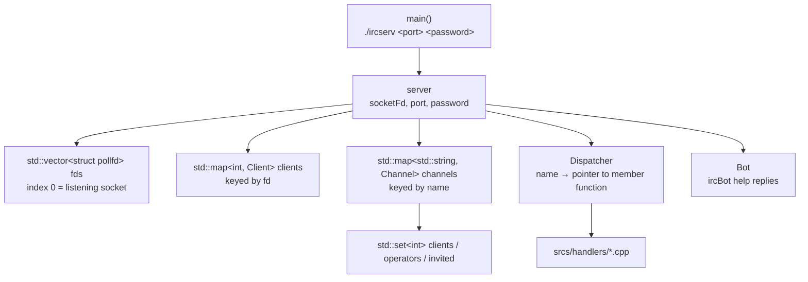
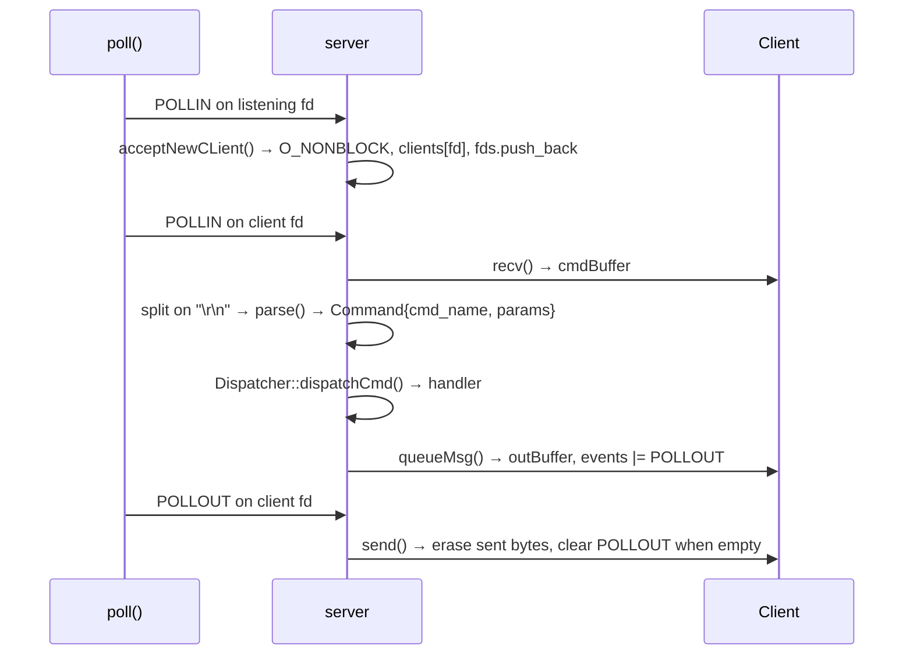
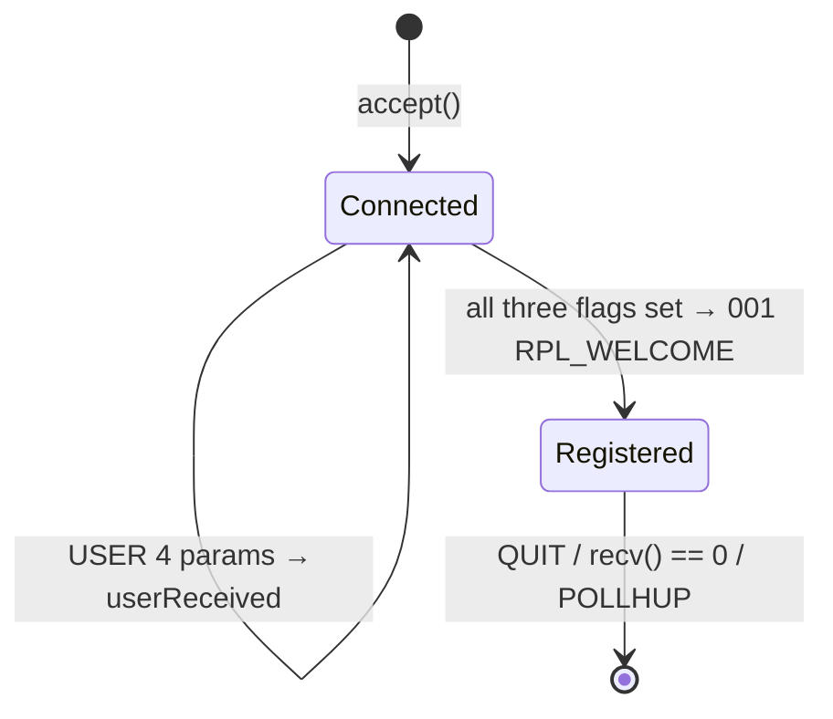

# ft_irc

[← Back to repository overview](../README.md) · [Glossary](../GLOSSARY.md)

An IRC server written in C++98: one process, no threads, every socket non-blocking and
multiplexed through a single `poll()` call. It implements the subset of RFC 1459 / RFC 2812
required by the subject, so real clients (irssi, HexChat, WeeChat) can register, join
channels and talk to each other. The user-facing manual — every command, its syntax and its
error replies — is in [`README.md`](./README.md); this page documents the internals.

```sh
cd IRC && make
./ircserv 6667 secretpass
```

The binary is `ircserv`, built with `-Wall -Wextra -Werror -std=c++98` and
`-I includes`. `make clean`, `fclean` and `re` behave as usual.

## Contents

| Path | Description |
| ---- | ----------- |
| [`srcs/main.cpp`](./srcs/main.cpp) | Entry point: argument count check, `SIGINT` / `SIGQUIT` handlers, `initServer()` inside a `try` block |
| [`srcs/Server.cpp`](./srcs/Server.cpp) | Socket setup, `poll()` loop, accept / recv / send, `\r\n` framing, `parse()`, numeric replies, channel broadcast |
| [`srcs/Client.cpp`](./srcs/Client.cpp) | Per-client state: fd, registration flags, nickname / username / realname, input and output buffers |
| [`srcs/Channel.cpp`](./srcs/Channel.cpp) | Per-channel state: member, operator and invite sets, topic, modes `+i` `+t` `+k` `+l` |
| [`srcs/Dispatcher.cpp`](./srcs/Dispatcher.cpp) | `std::map<std::string, void (server::*)(Client&, const Command&)>` command table |
| [`srcs/handlers/`](./srcs/handlers) | One file per command: `Pass`, `Nick`, `User`, `Join`, `Part`, `Topic`, `Invite`, `Kick`, `Mode`, `Privmsg`, `Quit` |
| [`srcs/Bot.cpp`](./srcs/Bot.cpp) | Bonus `ircBot`: answers `!help`, `!commands`, `!usage <cmd>`, `!about` |
| [`includes/Numeric.hpp`](./includes/Numeric.hpp) | The 22 numeric reply codes the server can send |
| [`README.md`](./README.md) | Command manual, numeric reply table, technical choices, resources |

## Object model



Clients and channels are stored **by fd and by name**, never by pointer, so no handler can
hold a dangling reference after a disconnection: `clearClient()` erases the fd from every
channel, from `fds` and from `clients` in one place.

## The event loop

`initServer()` runs the socket sequence once — `socket()`, `setsockopt(SO_REUSEADDR)`,
`fcntl(O_NONBLOCK)`, `bind()`, `listen(SOMAXCONN)` — pushes the listening fd into `fds`
with `POLLIN`, then enters `run()`.



Details that make the loop robust:

- **`poll(&fds[0], fds.size(), -1)`** blocks indefinitely; `EINTR` (a signal arriving) is
  retried instead of being treated as a failure, any other error throws.
- **`POLLHUP | POLLERR | POLLNVAL`** on a client fd disconnects it immediately.
- The iteration index is only incremented when the current entry survived: `readData()`
  returning `1` means the client was removed and `fds` shifted, so the loop `continue`s
  without `++i`.
- `SIGINT` / `SIGQUIT` set the static `server::sig` flag to `false`; the loop finishes its
  current pass, then `closeFds()` closes every client and the listening socket.

## Message framing and parsing

TCP delivers a byte stream, so a command can arrive split across packets or several
commands can arrive in one packet. `readData()` appends whatever `recv()` returned to the
client's `cmdBuffer` and then drains it:

```cpp
while (true)
{
    size_t pos = clients[fd].getBuffer().find("\r\n");
    if (pos == std::string::npos)
        break;                                   // incomplete line, wait for more data
    std::string line = clients[fd].getBuffer().substr(0, pos);
    clients[fd].getBuffer().erase(0, pos + 2);
    dispatcher.dispatchCmd(*this, clients[fd], parse(line));
}
```

`parse()` reads the command name with `std::istringstream`, then each space-separated
parameter, and stops at the first parameter starting with `:` — that one and the rest of
the line become a single trailing parameter, which is what makes
`PRIVMSG #general :hello world` arrive as two params instead of three.

Output is symmetric: handlers never call `send()`. `queueMsg(fd, msg)` appends to the
recipient's `outBuffer` and enables `POLLOUT` on its `pollfd`; `sendData()` sends what it
can, erases only the bytes actually written (partial `send()` is normal on a non-blocking
socket) and clears `POLLOUT` when the buffer is empty.

`sendNumeric()` formats server replies as `:server <3-digit code> <params> :<message>`,
zero-padded with `std::setw(3)` so `001` is not sent as `1`; `sendToChannel()` queues one
message for every member of a channel.

## Dispatch

`Dispatcher`'s constructor fills a table of pointers to member functions of `server`:

```cpp
routes["JOIN"] = &server::Join;
...
(server.*(it->second))(client, command);   // unknown commands are silently ignored
```

Adding a command is therefore one file in `srcs/handlers/` plus one line in the map — no
`if/else` chain. Every handler follows the same shape: check registration, check parameter
count, look up the channel, check membership, check operator rights, mutate state,
broadcast.

## Registration state machine



`checkRegistration()` is called at the end of `Pass`, `Nick` and `User` and flips
`registered` only when the three flags are true, so the three commands may arrive in any
order. Until then every other handler answers `451 ERR_NOTREGISTERED`. `PASS` and `USER`
become no-ops once registered; `NICK` keeps working and is rejected with
`433 ERR_NICKNAMEINUSE` when `nicknameExists()` finds the nickname on another client.

## Channels and operator rights

`Channel` keeps three `std::set<int>` of file descriptors — `clients`, `operators`,
`invited` — plus the topic, the key and the mode flags.

- The **creator of a channel becomes its operator** (`Join` inserts into both `clients` and
  `operators` when the map lookup misses).
- `removeClient()` erases the fd from `clients` *and* `operators`, so privileges cannot
  outlive membership.
- Whenever an operator leaves (`PART`, `KICK`, `QUIT`, disconnection),
  `promoteNewOperator()` promotes `*clients.begin()` — the channel is never left without an
  operator.
- An empty channel is erased from the `channels` map, which is why iterating over channels
  in `clearClient()` / `Quit` advances the iterator *before* calling `erase()`.
- Mode `+i` is enforced through the `invited` set: `INVITE` adds the target fd, and `JOIN`
  removes it again, so an invitation is single-use.

Mode arguments are validated before being applied: `+k` refuses an empty key, `+l` refuses
a non-positive limit (`std::atoi` result `<= 0`), `+o` / `-o` require the target nickname to
exist *and* to be on the channel. Any flag outside `i t k l o` yields
`472 ERR_UNKNOWNMODE`, and the accepted change is broadcast to all members as a real `MODE`
line.

## Bonus — ircBot

`Bot` is a member of `server`, not a connected client. `Privmsg` calls
`bot.handleCommand()` after the channel and membership checks; if the message text is one
of the four triggers the bot's answer is broadcast from `ircBot!bot@localhost` and the
original message is *not* relayed, otherwise the handler continues normally. Triggers:
`!help`, `!commands`, `!usage <COMMAND>`, `!about`.

## Concepts introduced

| Concept | Where |
| ------- | ----- |
| TCP listening socket, `SO_REUSEADDR` | `createSocket()`, `configSocket()` |
| Non-blocking I/O with `fcntl(O_NONBLOCK)` | listening socket and every accepted socket |
| I/O multiplexing with `poll()` | `run()` |
| Stream framing on a delimiter | `readData()`, `Client::cmdBuffer` |
| Output buffering and partial writes | `queueMsg()`, `sendData()` |
| Table-driven dispatch with pointers to member functions | `Dispatcher` |
| Protocol state machine | `checkRegistration()`, `Client` flags |
| Numeric reply protocol | `sendNumeric()`, `includes/Numeric.hpp` |
