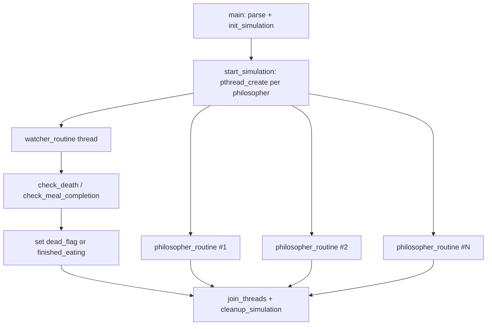
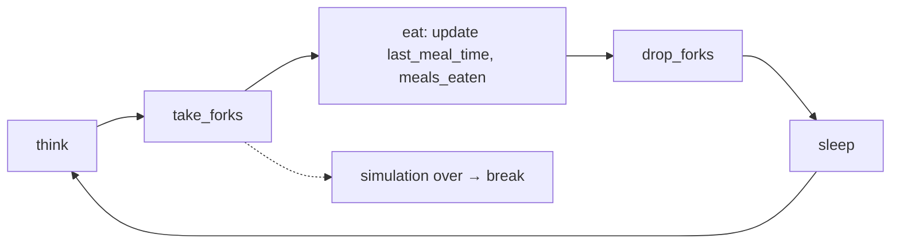

# Philosophers

[← Back to repository overview](../README.md) · [Glossary](../GLOSSARY.md)

An implementation of the dining philosophers problem: one thread per philosopher, one
mutex per fork, and a monitoring thread that detects starvation. The project is about
avoiding deadlock and data races while keeping timing accurate to the millisecond.

## Build and run

```sh
cd Philosophers && make     # produces ./philo
./philo <num_philos> <time_to_die> <time_to_eat> <time_to_sleep> [must_eat_count]
./philo 5 800 200 200
```

All times are in milliseconds. `ft_parse` ([`parse.c`](./parse.c)) rejects
non-numeric and non-positive values, and `ft_man` prints usage.

## Structures — [`philo.h`](./philo.h)

```c
typedef struct s_philo
{
	int					id;
	pthread_t			thread;
	pthread_mutex_t		*left_fork;
	pthread_mutex_t		*right_fork;
	pthread_mutex_t		meal_mutex;
	int					meals_eaten;
	long				last_meal_time;
	int					eating;
	struct s_simulation	*sim;
}	t_philo;

typedef struct s_simulation
{
	t_config			config;
	t_philo				*philosophers;
	pthread_mutex_t		*forks;
	pthread_mutex_t		print_mutex;
	pthread_mutex_t		death_mutex;
	int					dead_flag;
	pthread_mutex_t		meal_mutex;
	int					finished_eating;
	long				start_time;
	pthread_t			watcher_thread;
}	t_simulation;
```

Mutex roles:

| Mutex | Protects |
| ----- | -------- |
| `forks[i]` | A single fork (shared between two neighbours) |
| `philo->meal_mutex` | `last_meal_time`, `meals_eaten`, `eating` of one philosopher |
| `print_mutex` | Serialises log output so lines never interleave |
| `death_mutex` | `dead_flag` and `finished_eating` — the simulation stop condition |

## Threading model



## Philosopher routine — [`philo.c`](./philo.c), [`routine.c`](./routine.c)



Deadlock avoidance relies on asymmetric fork ordering in `take_forks`:

```c
if (philo->id % 2 == 0)
	/* right fork first, then left */
else
	/* left fork first, then right */
```

Even-numbered philosophers also start with a `ft_usleep(1)` offset so that neighbours do
not reach for the same fork simultaneously. Before and between each lock, the routine
re-checks `is_simulation_over` and unlocks anything already held, so no thread stays
blocked once the simulation ends.

The single-philosopher case is special-cased in `single_philo_routine`: with one fork
available, the philosopher takes it, waits `time_to_die` and dies.

## Watcher — [`watcher.c`](./watcher.c)

The watcher polls every philosopher:

- `check_death` reads a consistent snapshot via `get_status` (under `meal_mutex`) and
  declares a death when the philosopher is not currently eating and
  `current - last_meal >= time_to_die + 2`. The condition is re-verified after taking
  `death_mutex` to avoid a false positive from a stale read.
- `check_meal_completion` sets `finished_eating` once every philosopher has reached
  `must_eat_count` (only when `must_eat_flag` is set).

The death message is printed while holding `print_mutex`, and `dead_flag` is set before
printing so no other thread can log an action after the death line.

## Cleanup

[`memory_free.c`](./memory_free.c) destroys every mutex
(`cleanup_mutex`) and frees the philosopher and fork arrays; `join_threads`
([`threads.c`](./threads.c)) joins all worker threads plus the watcher
before cleanup so no mutex is destroyed while still in use.
