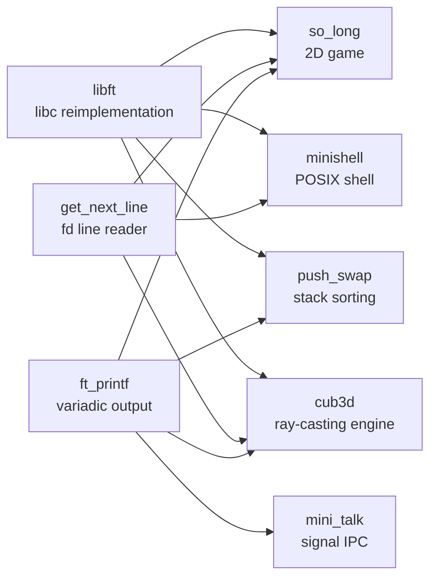
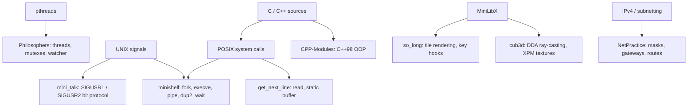

# 1337 Projects — Repository Overview

This repository is a monorepo gathering the projects of the **1337 (42 Network)** common
core cursus. Each top-level directory is a self-contained project with its own `Makefile`,
sources and subject PDF, and together they form a progression from writing a C standard
library from scratch up to a multi-process shell and a ray-casting 3D engine.

The projects are deliberately built on top of each other: the low-level utilities written
in the first tier (`libft`, `ft_printf`, `get_next_line`) are vendored into later projects
instead of relying on the C standard library, which is why several directories contain
their own copy of those sources.

## Project Progression and Scope

| Tier | Theme | Projects | Scope |
| ---- | ----- | -------- | ----- |
| 1 | Foundations | `libft`, `printf`, `get_next_line` | Reimplementing libc primitives, variadic formatted output and buffered file-descriptor reading. Memory ownership and manual allocation. |
| 2 | Algorithms | `push_swap` | Sorting integers through a restricted stack instruction set, optimising for total operation count. |
| 3 | Unix Systems | `mini_talk`, `minishell` | Process creation, signals as an IPC channel, pipes, file descriptors, redirections and environment management. |
| 4 | Graphics | `so_long`, `cub3d` | MiniLibX rendering: 2D tile maps with flood-fill validation, then a DDA ray-caster with textured walls and a minimap. |
| 5 | Concurrency | `Philosophers` | POSIX threads, mutexes, starvation and deadlock avoidance under real-time constraints. |
| 6 | Infrastructure | `Born2beRoot`, `NetPractice` | Virtual machine hardening (LVM, SSH, UFW, sudo policy) and IPv4 subnetting/routing configuration. |
| 7 | OOP | `CPP-Modules` | C++98 object-oriented programming: classes, orthodox canonical form, inheritance, polymorphism and abstract interfaces. |

## Project Interconnectivity Diagram

## Technical Entity Mapping

## Navigation and Directory Structure

Each project's documentation lives inside its own directory, so opening the folder shows
the write-up next to the sources. Projects that already had a `README.md` keep it and carry
the deep dive in `DOCUMENTATION.md`.

| Project Name           | Directory                            | Documentation                                              |
| ---------------------- | ------------------------------------ | ---------------------------------------------------------- |
| 0. LIBFT               | [libft](./libft)                     | [libft/README.md](./libft/README.md)                        |
| 1. PRINTF              | [printf](./printf)                   | [printf/README.md](./printf/README.md)                      |
| 2. GET_NEXT_LINE       | [get_next_line](./get_next_line)     | [get_next_line/README.md](./get_next_line/README.md)        |
| 3. BORN2BEROOT         | [Born2beRoot](./Born2beRoot)         | [Born2beRoot/DOCUMENTATION.md](./Born2beRoot/DOCUMENTATION.md) |
| 4. PUSH_SWAP           | [push_swap](./push_swap)             | [push_swap/README.md](./push_swap/README.md)                |
| 5. MINI_TALK           | [mini_talk](./mini_talk)             | [mini_talk/README.md](./mini_talk/README.md)                |
| 6. SO_LONG             | [so_long](./so_long)                 | [so_long/README.md](./so_long/README.md)                    |
| 7. MINISHELL           | [minishell](./minishell)             | [minishell/README.md](./minishell/README.md)                |
| 8. PHILOSOPHERS        | [philosophers](./Philosophers)       | [Philosophers/README.md](./Philosophers/README.md)          |
| 9. CPP MODULES         | [CPP-Modules](./CPP-Modules)         | [CPP-Modules/DOCUMENTATION.md](./CPP-Modules/DOCUMENTATION.md) |
| 10. CUB3D              | [cub3d](./cub3d)                     | [cub3d/README.md](./cub3d/README.md)                        |
| 11. NETPRACTICE        | [NetPractice](./NetPractice)         | [NetPractice/DOCUMENTATION.md](./NetPractice/DOCUMENTATION.md) |

Terminology shared by all of them is collected in [`GLOSSARY.md`](./GLOSSARY.md).

## Major Project Sections

- **Foundation Libraries** — `libft`, `printf` and `get_next_line` provide the string,
  memory, list, output and I/O primitives reused by nearly every later project.
- **Algorithms** — `push_swap` sorts integers with only stack operations, choosing the
  cheapest element to move on every iteration.
- **Unix Systems** — `mini_talk` transmits strings bit by bit with two signals, while
  `minishell` implements a full command interpreter with pipes, redirections, heredocs,
  environment handling and builtins.
- **Graphics** — `so_long` renders a validated tile map with MiniLibX; `cub3d` extends the
  same library into a textured DDA ray-caster with a minimap.
- **Concurrency** — `Philosophers` simulates the dining philosophers problem with one
  thread per philosopher, per-fork mutexes and a monitoring thread.
- **Infrastructure** — `Born2beRoot` covers virtualization and system hardening;
  `NetPractice` covers IPv4 addressing, masks and routing tables.
- **Object-Oriented Programming** — `CPP-Modules` walks through C++98 classes, references,
  fixed-point arithmetic, inheritance, polymorphism and abstract interfaces.
