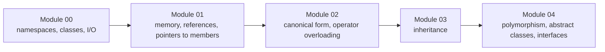
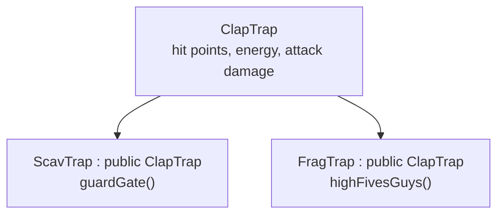

# CPP Modules

[← Back to repository overview](../README.md) · Source: [`./CPP-Modules`](../CPP-Modules)

A progression of C++98 exercises introducing object-oriented programming to students coming
from C. Every exercise is a standalone directory with its own `Makefile`; the compiler
flags are `-Wall -Wextra -Werror -std=c++98`.

```sh
cd CPP-Modules/CPP-Module-02/ex00 && make && ./<binary>
```

## Module map



## Module 00 — [`CPP-Module-00`](../CPP-Modules/CPP-Module-00)

| Exercise | Content |
| -------- | ------- |
| [`ex00`](../CPP-Modules/CPP-Module-00/ex00) | `megaphone.cpp` — uppercase every argument, first contact with `std::cout` and `std::string` |
| [`ex01`](../CPP-Modules/CPP-Module-00/ex01) | Phonebook: `Contact` and `PhoneBook` classes, fixed-size storage of 8 contacts, formatted column output, `ADD` / `SEARCH` / `EXIT` command loop |

Concepts: classes vs. structs, member functions, encapsulation, `std::string`, stream
manipulators (`std::setw`).

## Module 01 — [`CPP-Module-01`](../CPP-Modules/CPP-Module-01)

| Exercise | Content |
| -------- | ------- |
| [`ex00`](../CPP-Modules/CPP-Module-01/ex00) | `Zombie` — heap (`newZombie`) vs. stack (`randomChump`) allocation |
| [`ex01`](../CPP-Modules/CPP-Module-01/ex01) | `zombieHorde` — allocating an array of objects with `new[]` |
| [`ex02`](../CPP-Modules/CPP-Module-01/ex02) | "Brain" — addresses, pointers and references to the same variable |
| [`ex03`](../CPP-Modules/CPP-Module-01/ex03) | `HumanA` / `HumanB` with a `Weapon` — reference member (always armed) vs. pointer member (optional) |
| [`ex04`](../CPP-Modules/CPP-Module-01/ex04) | Sed-like file filter using `std::ifstream` / `std::ofstream` |
| [`ex05`](../CPP-Modules/CPP-Module-01/ex05) | `Harl` — pointers to member functions replacing an if/else chain |
| [`ex06`](../CPP-Modules/CPP-Module-01/ex06) | `Harl` filter — the same dispatch driven by a `switch` with fall-through |

## Module 02 — [`CPP-Module-02`](../CPP-Modules/CPP-Module-02)

The `Fixed` fixed-point number class, built up over three exercises
([`Fixed.hpp`](../CPP-Modules/CPP-Module-02/ex00/Fixed.hpp)):

```cpp
class Fixed
{
    private:
        int fpoint_value;
        static const int fbits = 8;
    public:
        Fixed();
        Fixed(const Fixed &Cpy);
        Fixed& operator=(const Fixed &other);
        ~Fixed();
        int  getRawBits(void) const;
        void setRawBits(int const raw);
};
```

- `ex00` — the orthodox canonical form: default constructor, copy constructor, copy
  assignment operator, destructor.
- `ex01` — `int` and `float` constructors, `toInt()` / `toFloat()` conversions and the
  `operator<<` overload for `std::ostream`.
- `ex02` — comparison, arithmetic and increment/decrement operators plus the static
  `min` / `max` helpers.

The value is stored as an integer scaled by `1 << 8`, which is why conversions are shifts
and divisions by `256`.

## Module 03 — [`CPP-Module-03`](../CPP-Modules/CPP-Module-03)



Exercises `ex00`–`ex02` introduce single inheritance, constructor/destructor chaining
order, protected members and member overriding. `ScavTrap` and `FragTrap` each override
`attack` and add their own behaviour while reusing `ClapTrap`'s state.

## Module 04 — [`CPP-Module-04`](../CPP-Modules/CPP-Module-04)

| Exercise | Content |
| -------- | ------- |
| [`ex00`](../CPP-Modules/CPP-Module-04/ex00) | `Animal` / `Dog` / `Cat` with `virtual void makeSound()`, contrasted with `WrongAnimal` / `WrongCat` which omit `virtual` |
| [`ex01`](../CPP-Modules/CPP-Module-04/ex01) | `Brain` member — deep copy in the copy constructor and assignment operator, plus a virtual destructor |
| [`ex02`](../CPP-Modules/CPP-Module-04/ex02) | `AbsAnimal` — abstract base class with a pure virtual `makeSound() const = 0`, which cannot be instantiated |
| [`ex03`](../CPP-Modules/CPP-Module-04/ex03) | Interfaces `ICharacter` / `IMateriaSource`, abstract `AMateria` with `clone()`, concrete `Ice` and `Cure`, inventory management in `Character` and `MateriaSource` |

Key takeaways: a base class with virtual functions needs a virtual destructor; deep copies
are mandatory when a class owns heap memory; and `clone()` is the C++98 way to duplicate a
polymorphic object without knowing its concrete type.
