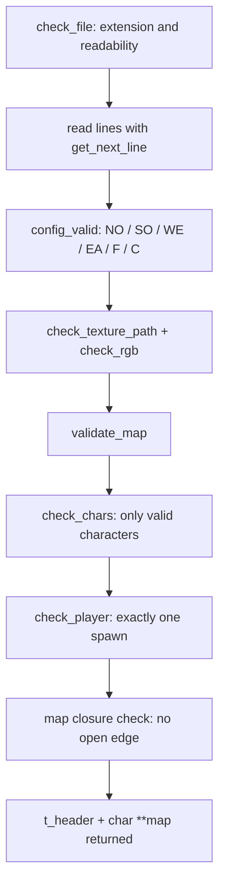
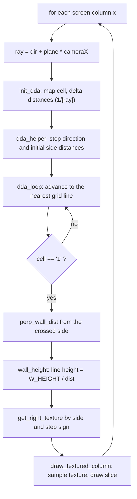

# cub3d

[← Back to repository overview](../README.md) · Source: [`./cub3d`](../cub3d)

A first-person ray-casting engine in the spirit of Wolfenstein 3D, built on MiniLibX. It
parses a `.cub` scene description, casts one ray per screen column with the DDA algorithm,
and draws textured wall slices plus a minimap.

## Build and run

```sh
cd cub3d && make            # produces ./cub3d
./cub3d maps/valid/map1.cub
```

Controls (see [`includes/macros.h`](../cub3d/includes/macros.h)): `W`/`S` move along the
view direction, `A`/`D` strafe along the camera plane, `←`/`→` rotate, `ESC` quits.
Window size is `900x800`, movement speed `0.05` and rotation step `0.05` rad.

## Scene file format

Example [`maps/valid/map1.cub`](../cub3d/maps/valid/map1.cub):

```
NO textures/north.xpm
SO textures/south.xpm
WE textures/west.xpm
EA textures/east.xpm

F 32,42,42
C 200,30,0

        1111111
       1100001111111111
1111111000011111111111
...
```

Header entries may appear in any order with arbitrary leading whitespace; `F` and `C` take
`R,G,B` triplets. Map characters are `1` (wall), `0` (floor), space (void) and exactly one
of `N`, `S`, `E`, `W` giving the player's spawn and facing.
Invalid scenes for testing live in [`maps/not_valid`](../cub3d/maps/not_valid).

## Parsing — [`src/parse`](../cub3d/src/parse)



The parsed configuration is stored in `t_header`
([`includes/parse.h`](../cub3d/includes/parse.h)):

```c
typedef struct s_header
{
	char	*no_path;  char *so_path;  char *we_path;  char *ea_path;
	int		floor_color;  int ceiling_color;  char compass;
}	t_header;
```

Failures route through `print_error` / `throw_exit`, which free the partially built map
(`free_2d`) and the texture paths (`free_path`) before exiting.

## Rendering

Core state — [`includes/cub3d.h`](../cub3d/includes/cub3d.h): `t_game` holds the MiniLibX
handles, the map, the four wall textures (`textures[4]` indexed by `NORTH`, `SOUTH`,
`WEST`, `EAST`), the minimap image buffer, the DDA scratch state and the player.

```c
typedef struct s_player_info
{
	t_vec2	pos;     /* world position          */
	t_vec2	dir;     /* facing direction        */
	t_vec2	plane;   /* camera plane, FOV = 66° */
}	t_player;
```

`init_player_dir` ([`src/main.c`](../cub3d/src/main.c)) maps the spawn character to a
direction/plane pair, e.g. `N` → `dir = (0, -1)`, `plane = (0.66, 0)`.

### DDA ray casting — [`src/dda.c`](../cub3d/src/dda.c)



Near-vertical and near-horizontal rays are guarded with `EPS`/`INF` instead of dividing by
zero, and `perp_wall_dist` is clamped to `0.1` to keep the slice height finite when the
player hugs a wall. Texture sampling is computed in `t_text` (`wall_x`, `text_x`, `step`,
`text_pos`) and written into the image buffer by `put_img` /`put_mlx_pixel`, so a whole
frame is composed off-screen before being pushed to the window.

### Vectors — [`src/vector2d.c`](../cub3d/src/vector2d.c)

[`includes/vec2d.h`](../cub3d/includes/vec2d.h) defines a small `t_vec2` algebra
(`vec_add`, `vec_sub`, `vec_scale`, `vec_dot`, `vec_normalize`, `vec_rotate`, …). Rotation
of both `dir` and `plane` by the same angle is what turns the camera
([`src/keys.c`](../cub3d/src/keys.c)).

### Collision and minimap

Movement is tested per axis before being applied, so sliding along a wall works:

```c
if (game->map[(int)game->player.pos.y][(int)pos.x] != '1')
	game->player.pos.x = pos.x;
if (game->map[(int)pos.y][(int)game->player.pos.x] != '1')
	game->player.pos.y = pos.y;
```

[`src/minimap.c`](../cub3d/src/minimap.c) overlays a scaled top-down view (`MINIMAP_SIZE`,
`SCALE`) on the same image buffer.

## Cleanup

[`src/destory_game.c`](../cub3d/src/destory_game.c) destroys the images, the window and the
display, frees the map and the texture paths, then exits — wired to both the `ESC` key and
the window-close hook.
