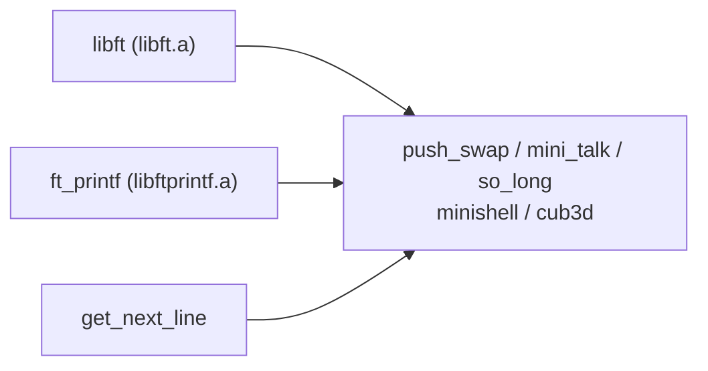
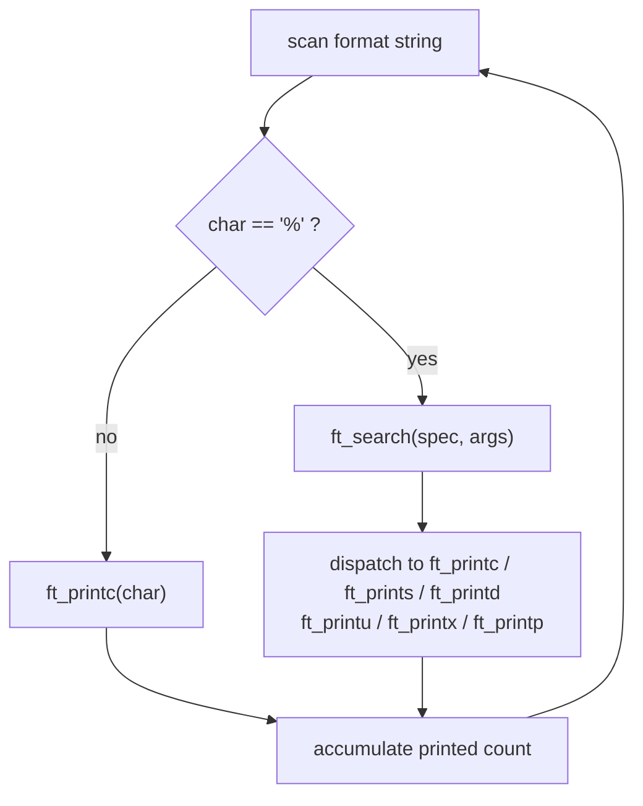
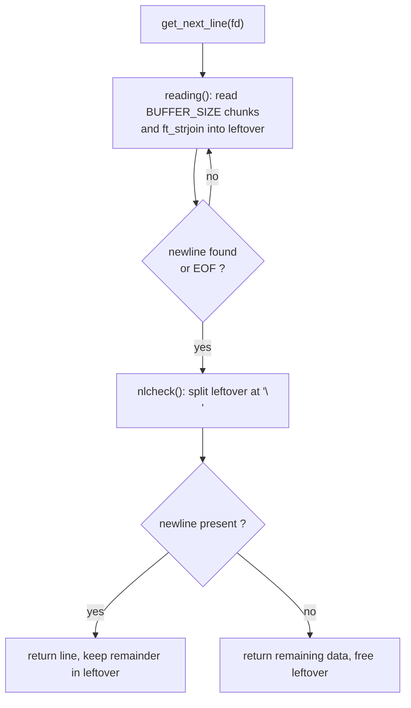

# Foundation Libraries — libft, ft_printf, get_next_line

[← Back to repository overview](../README.md)

The first tier of the cursus rebuilds the primitives that every later project depends on.
Because 42 projects forbid most of the C standard library, these three libraries are
vendored into `so_long`, `cub3d`, `minishell` and `mini_talk` rather than installed
system-wide.



## libft — [`./libft`](../libft)

A static library (`libft.a`) reimplementing a subset of libc plus extra helpers.

| Group | Functions |
| ----- | --------- |
| Character classification | `ft_isalpha`, `ft_isdigit`, `ft_isalnum`, `ft_isascii`, `ft_isprint`, `ft_toupper`, `ft_tolower` |
| Memory | `ft_memset`, `ft_bzero`, `ft_memcpy`, `ft_memmove`, `ft_memchr`, `ft_memcmp`, `ft_calloc` |
| Strings | `ft_strlen`, `ft_strlcpy`, `ft_strlcat`, `ft_strchr`, `ft_strrchr`, `ft_strncmp`, `ft_strnstr`, `ft_strdup`, `ft_substr`, `ft_strjoin`, `ft_strtrim`, `ft_split`, `ft_strmapi`, `ft_striteri` |
| Conversion | `ft_atoi`, `ft_itoa` |
| Output on a file descriptor | `ft_putchar_fd`, `ft_putstr_fd`, `ft_putendl_fd`, `ft_putnbr_fd` |

Build:

```sh
cd libft && make          # produces libft.a
```

The copy used by `cub3d` ([`cub3d/libft`](../cub3d/libft)) additionally ships the linked
list bonus (`ft_lstnew`, `ft_lstadd_back`, `ft_lstclear`, `ft_lstmap`, …) and the
`ft_putchar` / `ft_puts` / `ft_reverse` helpers, since the engine relies on them while
parsing `.cub` files.

Key implementation notes:

- Every allocating function (`ft_substr`, `ft_strjoin`, `ft_split`, `ft_itoa`, `ft_calloc`)
  returns freshly `malloc`ed memory whose ownership passes to the caller — the recurring
  source of leaks in later projects.
- `ft_split` allocates an array of strings terminated by a `NULL` pointer, which is the
  convention reused for `argv`-like arrays in `push_swap` and `minishell`.

## ft_printf — [`./printf`](../printf)

A variadic formatted-output function producing `libftprintf.a`.

Public API — [`printf/ft_printf.h`](../printf/ft_printf.h):

```c
int	ft_printf(const char *str, ...);
int	ft_printc(char c);
int	ft_prints(const char *str);
int	ft_printd(int n);
int	ft_printu(unsigned int n);
int	ft_printx(unsigned int n, char spec);
int	ft_printp(void *ptr);
```

Supported conversions: `%c`, `%s`, `%d`, `%i`, `%u`, `%x`, `%X`, `%p`, `%%`. Any other
character after `%` is printed literally as `%` followed by that character.

Control flow — [`printf/ft_printf.c`](../printf/ft_printf.c):



`ft_printf` returns the total number of characters written; each helper returns its own
count so the total is accumulated as the format string is consumed.

## get_next_line — [`./get_next_line`](../get_next_line)

Reads a file descriptor one line at a time, returning a `malloc`ed string that includes
the trailing `\n` (except possibly for the last line), and `NULL` at EOF or on error.

Header — [`get_next_line/get_next_line.h`](../get_next_line/get_next_line.h):

```c
# ifndef BUFFER_SIZE
#  define BUFFER_SIZE 44
# endif

char	*get_next_line(int fd);
```

The state between calls is kept in a `static char *leftover` inside `get_next_line`, which
holds whatever was read past the last returned newline.



Notes:

- `fd < 0` or `BUFFER_SIZE <= 0` short-circuits to `NULL`.
- On a `read` error (`-1`) the accumulated buffer is freed and `NULL` is returned.
- The bonus variant ([`get_next_line_bonus.c`](../get_next_line/get_next_line_bonus.c))
  keeps one static buffer per file descriptor so several files can be read in parallel;
  this is the version vendored in [`so_long/srcs/gnl`](../so_long/srcs/gnl).
