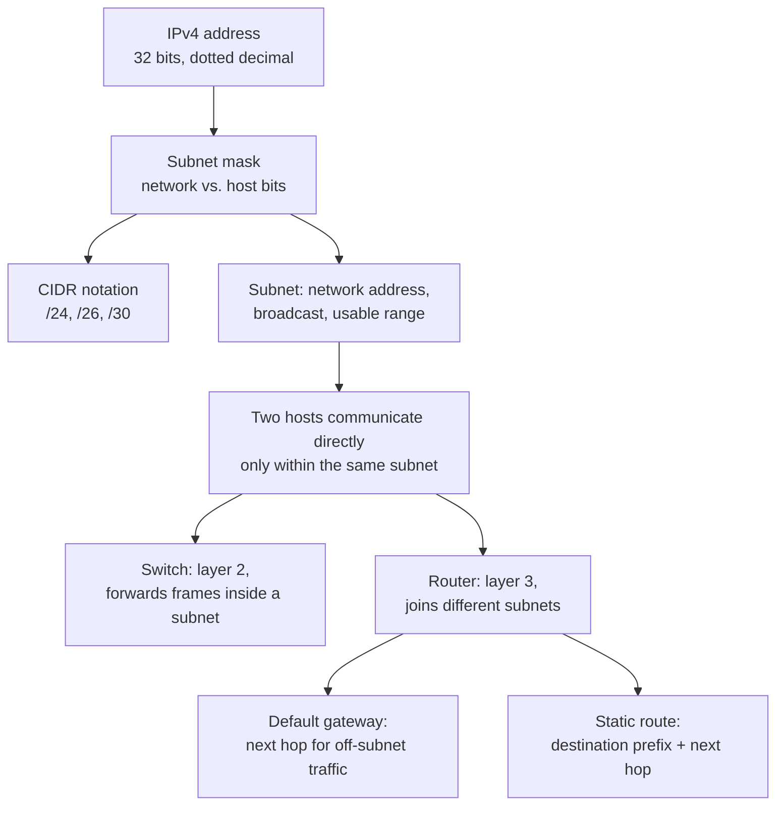

# NetPractice

[← Back to repository overview](../README.md) · Source: [`./NetPractice`](../NetPractice)

A networking exercise: ten levels of a browser-based simulator in which hosts, switches and
routers must be given consistent IP addresses, subnet masks, default gateways and routes so
that every device can reach its target. The deliverable is the exported configuration of
each level.

## Contents

| Path | Description |
| ---- | ----------- |
| [`configs/`](../NetPractice/configs) | Exported solutions, `level1.json` … `level10.json` |
| [`README.md`](../NetPractice/README.md) | Study checklist of the networking concepts required |
| `en.subject.pdf` | Project subject |

## Configuration format

Each level is a single JSON object with two keys: `ifs` (interfaces) and `routes`.

```json
{
  "routes": { "H3r1": { "gate": "154.176.183.194" },
              "R1r1": { "route": "154.176.183.0/24" } },
  "ifs":    { "H21": { "ip": "154.176.183.3", "mask": "255.255.255.128" },
              "R22": { "ip": "154.176.183.194", "mask": "/30" } }
}
```

- Interface keys combine the device name and the interface number, e.g. `H21` is host `H2`
  interface `1`, `R23` is router `R2` interface `3`.
- Route keys use the `r` suffix, e.g. `H3r1` is the first routing-table entry of host `H3`.
- `gate` is a default gateway; `route` plus `gate` is a static route to a specific prefix.
- Masks accept both dotted-decimal (`255.255.255.192`) and CIDR (`/30`) notation.
- Empty objects are fields that the simulator had already filled in and that the solution
  did not need to change.

Levels grow in difficulty: `level1.json` only assigns two host addresses, while
`level10.json` mixes `/25`, `/26` and `/30` subnets with routers requiring both default
gateways and explicit static routes.

## Concept map



## Rules that solve every level

1. Two interfaces on the same physical link must be in the same subnet — same network
   address under the same mask — and must not share the same IP.
2. Interfaces on opposite sides of a router must be in *different* subnets.
3. Neither the network address nor the broadcast address can be assigned to a host.
4. A host that must reach another subnet needs a default gateway that is itself inside the
   host's own subnet.
5. A router needs a route for every destination prefix it does not directly connect to; a
   `/30` is the usual choice for a point-to-point link between two routers, since it
   provides exactly two usable addresses.

## Reference table

| Mask | CIDR | Usable hosts |
| ---- | ---- | ------------ |
| `255.255.255.0` | `/24` | 254 |
| `255.255.255.128` | `/25` | 126 |
| `255.255.255.192` | `/26` | 62 |
| `255.255.255.224` | `/27` | 30 |
| `255.255.255.240` | `/28` | 14 |
| `255.255.255.248` | `/29` | 6 |
| `255.255.255.252` | `/30` | 2 |

Private ranges (RFC 1918): `10.0.0.0/8`, `172.16.0.0/12`, `192.168.0.0/16`. The loopback
address is `127.0.0.1`.
