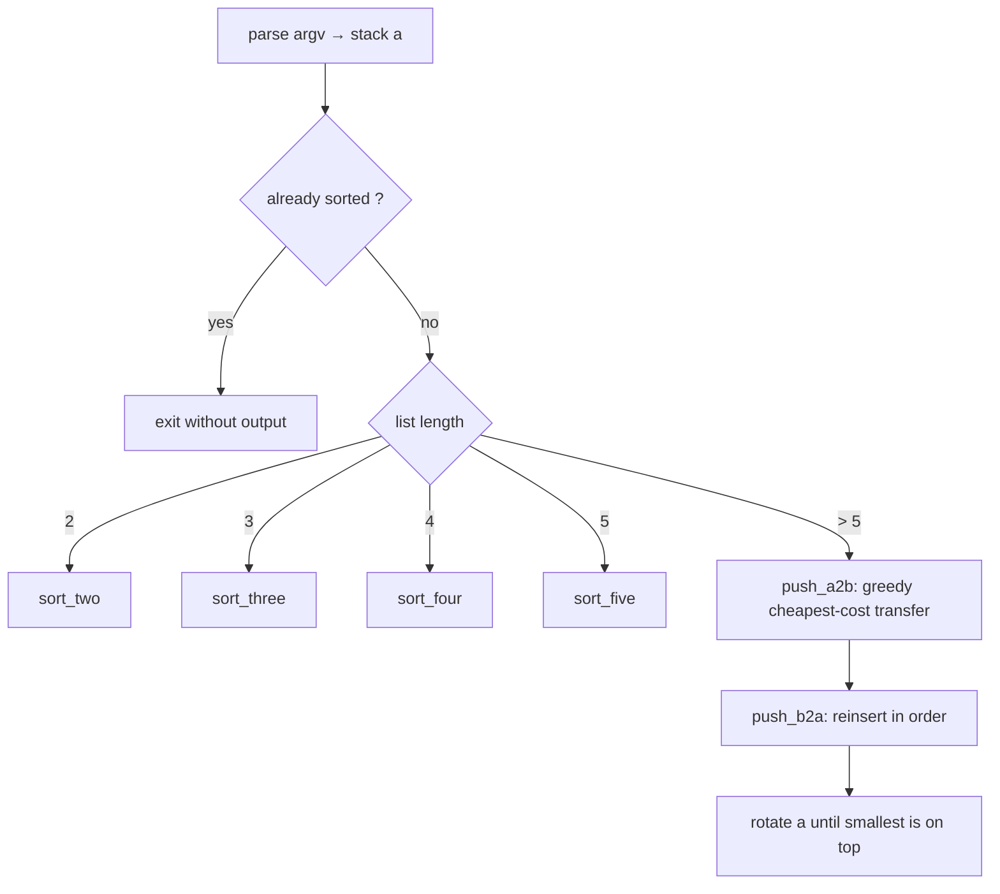

# push_swap

[← Back to repository overview](../README.md) · Source: [`./push_swap`](../push_swap)

Sort a list of integers using two stacks (`a` and `b`) and a restricted instruction set,
printing the operations performed. The score of the project is the number of operations,
so the implementation is a cost-driven greedy algorithm rather than a classic sort.

## Build and run

```sh
cd push_swap && make        # produces ./push_swap
./push_swap 4 67 3 87 23
```

Arguments may be passed either as separate `argv` entries or as a single quoted,
space-separated string; both go through [`input.c`](../push_swap/input.c) →
`ft_parsing`, which splits, validates and builds the initial stack.

## Data structure

[`push_swap/pushswap.h`](../push_swap/pushswap.h):

```c
typedef struct list_a
{
	int				num;
	struct list_a	*next;
}	t_lista;
```

Both stacks are singly linked lists; the head of the list is the top of the stack.

## Operation set

| Operation | Effect | File |
| --------- | ------ | ---- |
| `sa` / `sb` / `ss` | Swap the first two elements of `a` / `b` / both | [`operations.c`](../push_swap/operations.c) |
| `pa` / `pb` | Push the top of one stack onto the other | [`operations3.c`](../push_swap/operations3.c) |
| `ra` / `rb` / `rr` | Rotate up (first element becomes last) | [`operations2.c`](../push_swap/operations2.c) |
| `rra` / `rrb` / `rrr` | Reverse rotate (last element becomes first) | [`operations2.c`](../push_swap/operations2.c) |

Each operation takes a `msg` flag so the same primitive can be reused silently inside
combined operations (`ss`, `rr`, `rrr`) without printing twice.

## Algorithm



### Small cases

`sort_two`, `sort_three`, `sort_four` and `sort_five` in
[`sorting.c`](../push_swap/sorting.c) and [`sorting2.c`](../push_swap/sorting2.c) are
hard-coded optimal sequences; `sort_three` enumerates the six permutations and applies at
most two operations.

### Large cases — cost model

[`push_a2b.c`](../push_swap/push_a2b.c) computes, for every element of `a`, the cost of
bringing it to the top of `a` and its target slot to the top of `b`:

```c
index    = find_idx(stack_a, num);
cost_in_a = min(index, list_len(stack_a) - index);
cost_in_b = min(pos,   list_len(stack_b) - pos);
return (cost_in_a + cost_in_b);
```

`find_position` locates where the number belongs in `b` (which is kept in descending
order): above the largest, above the smallest, or between two neighbours. The element with
the lowest total cost is selected, then `shift_and_push` uses the combined `rr` / `rrr`
operations while both stacks need rotation in the same direction, which is what saves the
bulk of the operations. Finally `shift_2top_a` / `shift_2top_b` finish the per-stack
rotations and `pb` moves the element.

[`push_b2a.c`](../push_swap/push_b2a.c) mirrors this for the return trip, pushing back the
largest remaining element of `b` and ending with rotations so that `a` is sorted ascending
with the smallest value on top.

## Error handling

[`error_handling.c`](../push_swap/error_handling.c) prints `Error` on the standard error
and exits for: non-numeric arguments, values outside `int` range, duplicates, and empty
arguments. `exiting` frees both the split array and the partially built list before
exiting, and `sorted` short-circuits when the input is already ordered.
