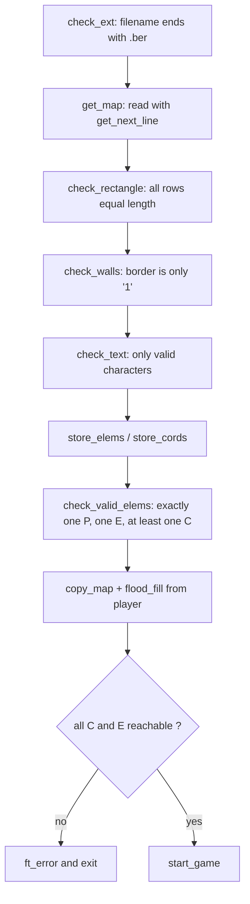

# so_long

[← Back to repository overview](../README.md) · Source: [`./so_long`](../so_long)

A small 2D tile-based game rendered with MiniLibX: the player walks a `.ber` map,
collects every item, then reaches the exit. The bulk of the project is not the game loop
but the map validation.

## Build and run

```sh
cd so_long && make          # produces ./so_long
./so_long maps/map1.ber
```

The project vendors its own dependencies under [`so_long/srcs`](../so_long/srcs):
[`libft`](../so_long/srcs/libft), [`printf`](../so_long/srcs/printf) and the multi-fd
[`gnl`](../so_long/srcs/gnl) used to read the map file line by line.

## Map format

Maps live in [`so_long/maps`](../so_long/maps). Example
([`map1.ber`](../so_long/maps/map1.ber)):

```
1111111111111
10010000000C1
1000011111001
1P0011E000001
1111111111111
```

| Char | Meaning |
| ---- | ------- |
| `1` | Wall |
| `0` | Walkable ground |
| `P` | Player start |
| `C` | Collectible |
| `E` | Exit |

Deliberately broken maps are provided as `map_error*.ber` for testing the parser.

## Core structures — [`so_long.h`](../so_long/so_long.h)

```c
typedef struct elems { int player; int col; int exit; }	t_elems;
typedef struct cords { int player_x; int player_y; int exit_x; int exit_y; } t_cords;
typedef struct core
{
	void	*mlx;   void *win;   char **map;
	t_cords	cords;  t_elems elems;
	void	*player; void *key; void *exit; void *wall; void *ground;
	int		moves;
}	t_core;
```

Key codes are defined as `ESC 65307`, `W 119`, `A 97`, `S 115`, `D 100`.

## Validation pipeline



`flood_fill` ([`parser/parser_path.c`](../so_long/parser/parser_path.c)) runs on a
duplicate of the map produced by `copy_map`/`copying`, so the recursive fill can overwrite
tiles freely while decrementing the collectible and exit counters. Reachability is
confirmed only if every counter reaches zero.

Errors funnel through `ft_error` / `throw_error`
([`parser/errors.c`](../so_long/parser/errors.c)), which free the map array before exiting.

## Rendering and game loop — [`game/game.c`](../so_long/game/game.c)

Textures are XPM files in [`so_long/textures`](../so_long/textures) (`wall`, `ground`,
`player`, `key`, `door`) loaded once by `init_textures`. `render_textures` iterates the map
and calls `mlx_put_image_to_window` at a fixed 40-pixel tile pitch:

```c
mlx_put_image_to_window(game->mlx, game->win, img, x * 40, y * 40);
```

`key_handler` translates `W`/`A`/`S`/`D` into a candidate coordinate, rejects the move if
the target tile is a wall, decrements `elems.col` when stepping on a `C`, and calls
`end_game` when stepping on `E` with no collectibles left. Each accepted move increments
`moves` and prints the counter with `ft_printf`. `ESC` and the window close button both
route to `close_window`, which destroys the images, the window and the display before
exiting.
