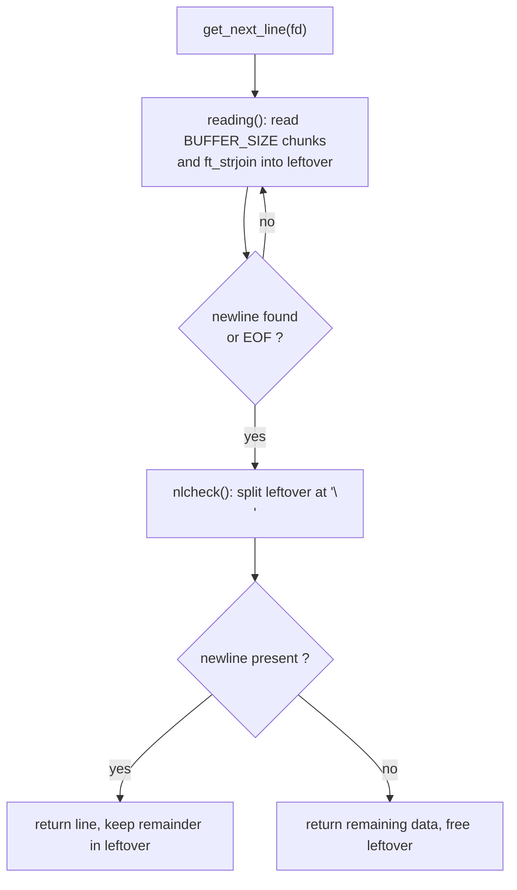

# get_next_line

[← Back to repository overview](../README.md) · [Glossary](../GLOSSARY.md)

Reads a file descriptor one line at a time. Each call returns a `malloc`ed string
containing the next line including its trailing `\n` (the last line may have none), and
`NULL` at end of file or on error.

The multi-fd bonus version is vendored into [`so_long/srcs/gnl`](../so_long/srcs/gnl), and
[`cub3d/gnl`](../cub3d/gnl) uses it to read `.cub` scene files.

## API — [`get_next_line.h`](./get_next_line.h)

```c
# ifndef BUFFER_SIZE
#  define BUFFER_SIZE 44
# endif

char	*get_next_line(int fd);
```

`BUFFER_SIZE` is overridable at compile time:

```sh
cc -D BUFFER_SIZE=1024 get_next_line.c get_next_line_utils.c main.c
```

## Files

| File | Content |
| ---- | ------- |
| [`get_next_line.c`](./get_next_line.c) | Mandatory version, one static buffer |
| [`get_next_line_utils.c`](./get_next_line_utils.c) | `ft_strlen`, `ft_strchr`, `ft_strjoin`, `ft_substr` helpers |
| [`get_next_line_bonus.c`](./get_next_line_bonus.c) | Bonus version, one static buffer per file descriptor |
| [`get_next_line_utils_bonus.c`](./get_next_line_utils_bonus.c) | Helpers for the bonus version |

## How it works

State between calls lives in a `static char *leftover` holding everything read past the
last returned newline.



Notes:

- `fd < 0` or `BUFFER_SIZE <= 0` short-circuits to `NULL`.
- A `read` error (`-1`) frees the accumulated buffer and returns `NULL`.
- `freeing()` frees a buffer and sets the pointer to `NULL`, which is what keeps the
  repeated `ft_strjoin` reallocation loop free of dangling pointers.
- The bonus version keeps one static buffer per file descriptor, so several files can be
  read in an interleaved fashion.

## Related

- [`libft`](../libft/README.md) — libc reimplementation
- [`printf`](../printf/README.md) — variadic formatted output
