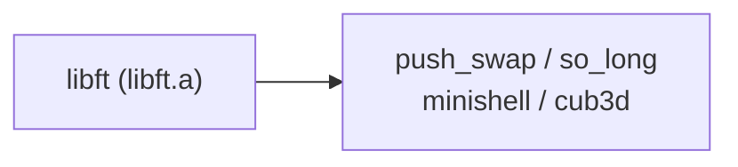

# libft

[← Back to repository overview](../README.md) · [Glossary](../GLOSSARY.md)

The first project of the cursus: a static library (`libft.a`) reimplementing a subset of
the C standard library plus a few extra helpers. Because 42 projects forbid most of libc,
this library is vendored into nearly every later project —
[`minishell/libft`](../minishell/libft), [`cub3d/libft`](../cub3d/libft) and
[`so_long/srcs/libft`](../so_long/srcs/libft) all carry a copy.



## Build

```sh
make          # produces libft.a
make clean    # remove object files
make fclean   # remove object files and libft.a
make re
```

Compiled with `cc -Wall -Wextra -Werror` and archived with `ar`.

## API — [`libft.h`](./libft.h)

| Group | Functions |
| ----- | --------- |
| Character classification | `ft_isalpha`, `ft_isdigit`, `ft_isalnum`, `ft_isascii`, `ft_isprint`, `ft_toupper`, `ft_tolower` |
| Memory | `ft_memset`, `ft_bzero`, `ft_memcpy`, `ft_memmove`, `ft_memchr`, `ft_memcmp`, `ft_calloc` |
| Strings | `ft_strlen`, `ft_strlcpy`, `ft_strlcat`, `ft_strchr`, `ft_strrchr`, `ft_strncmp`, `ft_strnstr`, `ft_strdup`, `ft_substr`, `ft_strjoin`, `ft_strtrim`, `ft_split`, `ft_strmapi`, `ft_striteri` |
| Conversion | `ft_atoi`, `ft_itoa` |
| Output on a file descriptor | `ft_putchar_fd`, `ft_putstr_fd`, `ft_putendl_fd`, `ft_putnbr_fd` |

## Implementation notes

- Every allocating function (`ft_substr`, `ft_strjoin`, `ft_split`, `ft_itoa`, `ft_calloc`)
  returns freshly `malloc`ed memory whose ownership passes to the caller — the recurring
  source of leaks in the later projects.
- `ft_split` returns a `NULL`-terminated array of strings; this is the convention reused
  for `argv`-like arrays in [`push_swap`](../push_swap) and [`minishell`](../minishell).
- The `f`-suffixed variants (`ft_strmapi`, `ft_striteri`) take a function pointer applied
  to each character together with its index.

## Variants in this repository

The copy shipped with [`cub3d`](../cub3d/libft) additionally provides the linked-list bonus
(`ft_lstnew`, `ft_lstadd_front`, `ft_lstadd_back`, `ft_lstsize`, `ft_lstlast`,
`ft_lstdelone`, `ft_lstclear`, `ft_lstiter`, `ft_lstmap`) plus `ft_putchar`, `ft_puts` and
`ft_reverse`, which the engine uses while parsing `.cub` files.

## Related

- [`printf`](../printf/README.md) — variadic formatted output
- [`get_next_line`](../get_next_line/README.md) — line-by-line reading
