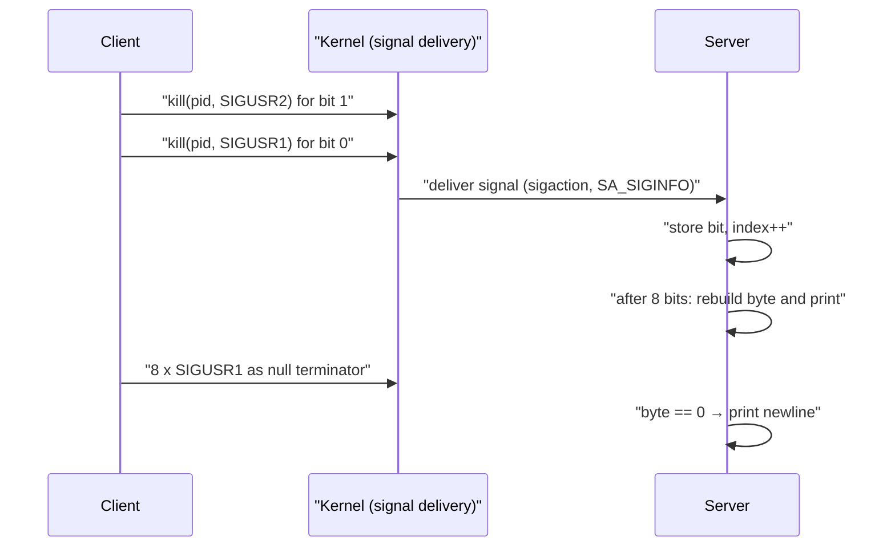

# mini_talk

[← Back to repository overview](../README.md) · [Glossary](../GLOSSARY.md)

A client/server pair that transmits strings between two processes using only the two
user-defined UNIX signals, `SIGUSR1` and `SIGUSR2`. There is no shared memory, socket or
file: every character is encoded bit by bit in the choice of signal.

## Build and run

```sh
cd mini_talk && make        # builds ./server and ./client
./server                    # prints its PID
./client <server_pid> "message"
```

`make bonus` builds the bonus variants ([`server_bonus.c`](./server_bonus.c),
[`client_bonus.c`](./client_bonus.c)), which add acknowledgement handling.
Output uses the vendored [`ft_printf`](./printf).

## Protocol



## Client — [`client.c`](./client.c)

`send_bit` walks a byte from the most significant bit down to bit 0:

```c
if ((byte >> i) & 1)
	kill(pid, SIGUSR2);
else
	kill(pid, SIGUSR1);
usleep(850);
```

The `usleep(850)` throttle gives the server time to handle each signal — standard signals
are not queued, so sending faster than the receiver can process would silently drop bits.
After the message, `send_null` sends eight `SIGUSR1` to transmit the terminating `\0`.

Invalid usage (`argc != 3`, empty message, negative PID) returns `-1` immediately.

## Server — [`server.c`](./server.c)

The handler is installed with `sigaction` and the `SA_SIGINFO` flag so that
`siginfo_t->si_pid` identifies the sender:

```c
sig.sa_sigaction = sig_handler;
sig.sa_flags = SA_SIGINFO;
sigemptyset(&sig.sa_mask);
sigaddset(&sig.sa_mask, SIGUSR1);
sigaddset(&sig.sa_mask, SIGUSR2);
```

Both signals are added to the handler's mask so that a second bit cannot interrupt the
handling of the first.

State is kept in `static` variables inside the handler: an 8-slot `bits` array, the current
`index`, and `ccp` — the PID of the client currently being served. When `si_pid` changes,
`set_values` resets the index, so a new client always starts on a byte boundary instead of
corrupting a partially received character.

`decode_bin` reassembles the byte MSB-first:

```c
char_byte |= bits[i] << (7 - i);
```

A decoded `\0` is printed as a newline, marking the end of a message. The main loop is
`while (1) pause();`, so the process only wakes on signal delivery.
