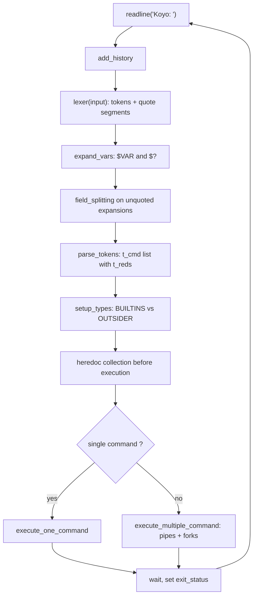

# minishell

[← Back to repository overview](../README.md) · [Glossary](../GLOSSARY.md)

A POSIX-style command interpreter written in C with `readline`. It tokenises input, expands
variables, builds a pipeline of commands with their redirections, and executes them with
`fork` / `execve`, handling builtins, heredocs, signals and exit statuses.

## Build and run

```sh
cd minishell && make        # produces ./minishell
./minishell
Koyo: ls -la | grep .c > out.txt
```

The prompt string is `Koyo: `. The project links its own
[`libft`](./libft) and requires the GNU `readline` library.

## Directory layout

| Directory | Responsibility |
| --------- | -------------- |
| [`include`](./include) | `minishell.h`, `structs.h`, `parser.h`, `execution.h`, `builtins.h`, `collector.h` |
| [`parser`](./parser) | Lexer, quote handling, expansion, field splitting, heredocs, parse tree |
| [`execution`](./execution) | Pipeline setup, redirections, path resolution, environment |
| [`execution/builtins`](./execution/builtins) | `echo`, `cd`, `pwd`, `export`, `unset`, `env`, `exit` |
| [`safe_allocation`](./safe_allocation) | Garbage-collected allocation (`t_collector`) |

## Data model — [`include/structs.h`](./include/structs.h)

```c
typedef enum e_types   { WORD, PIPE, R_IN, R_OUT, R_APPEND, R_HEREDOC } t_types;
typedef enum e_qtypes  { Q_NONE, Q_SINGLE, Q_DOUBLE }                  t_qtypes;
typedef enum e_cmd_type{ BUILTINS, OUTSIDER }                          t_cmd_type;

typedef struct s_segment { char *value; t_qtypes q_type; struct s_segment *next; } t_segment;
typedef struct s_tokens  { char *value; t_types type; t_segment *segments; struct s_tokens *next; } t_tokens;
typedef struct s_reds    { t_types type; char *flag; int quoted; char *heredoc_buff; struct s_reds *next; } t_reds;
typedef struct s_cmd     { char **args; t_cmd_type type; t_reds *reds; struct s_cmd *next; } t_cmd;
```

A token keeps its quoting information as a list of `t_segment`s, so `"a"b'c'` is a single
word whose parts are expanded differently depending on their quote type.

Global state lives in `t_global g_structs` ([`minishell.h`](./include/minishell.h)):
the allocation collector, the current command list and `exit_status`.

## Pipeline



### Lexing

[`parser/lexer.c`](./parser/lexer.c) dispatches on the current character:

- `handle_double_op` → `<<`, `>>`
- `handle_single_op` → `|`, `<`, `>`
- `handle_space` → separators
- `handle_word` → words, delegating to `handle_quoted` / `handle_unquoted`
  ([`lexer_quotes.c`](./parser/lexer_quotes.c),
  [`lexer_segments.c`](./parser/lexer_segments.c)) to record each segment's
  quote type

Unclosed quotes and misplaced operators are rejected by
[`parser_checks.c`](./parser/parser_checks.c) before execution, and the input is
discarded for the next prompt.

### Expansion

[`parser/expand.c`](./parser/expand.c) substitutes `$NAME` from the environment
list and `$?` from `g_structs.exit_status`. Single-quoted segments are left literal;
double-quoted segments expand but are not field-split.
[`field_split.c`](./parser/field_split.c) splits only unquoted expansion
results.

### Heredocs

[`herdoc.c`](./parser/herdoc.c) and its helpers read `<<` bodies before any
command runs, storing the text in `t_reds->heredoc_buff`. When the delimiter is quoted
(`t_reds->quoted`), the body is not expanded.

## Execution

[`execution/execution.c`](./execution/execution.c) forks one child per command:

```c
pid = fork();
if (pid == 0)
{
	execute_child(n_cmd, pipefd, i_cmd, cmd);   /* pipes + redirections */
	if (cmd->args[0] && cmd->type == OUTSIDER)
		execute_outsider_cmd(cmd);
	else if (cmd->args[0] && cmd->type == BUILTINS)
		execute_builtins_cmd(cmd);
	free_collector_all(0);
	exit(0);
}
```

- [`pipeline.c`](./execution/pipeline.c) — `execute_pipes` wires `dup2` for the
  correct ends of the pipe array depending on the command index.
- [`redirection.c`](./execution/redirection.c) — applies `R_IN`, `R_OUT`,
  `R_APPEND` and heredoc redirections; a redirection-only command (no `args[0]`) still
  creates or truncates its target files.
- [`execution_path.c`](./execution/execution_path.c) — `check_add_path` /
  `generate_right_path` resolve the binary against `PATH`. Failure sets `127`
  (command not found); a non-executable target sets `126`.
- [`env.c`](./execution/env.c) — the environment is a `t_env` linked list of
  key/value pairs, rebuilt into a `char **` for `execve` by `create_env_arr`.

Builtins are recognised by `setup_types`
([`execution_func.c`](./execution/execution_func.c)) against the list
`echo, cd, pwd, export, unset, env, exit`. A builtin alone on the command line runs in the
parent so that `cd` and `export` affect the shell itself; inside a pipeline it runs in the
child.

## Signals

`signal_handler` in [`main.c`](./main.c) handles `SIGINT` at the prompt: it
clears the current line, redisplays a fresh prompt and sets `exit_status = 130`. `SIGQUIT`
is ignored in the shell and restored to `SIG_DFL` in children.

## Memory management

[`safe_allocation/memory_system.c`](./safe_allocation/memory_system.c)
implements a collector: `safe_malloc` records every allocation in a `t_collector` linked
list, `free_collector_one` releases a single block, and `free_collector_all` wipes
everything allocated for the current command (`flaged = 1`) or for the whole session
(`flaged = 0`) — which is what makes the parser code free of manual cleanup paths.
