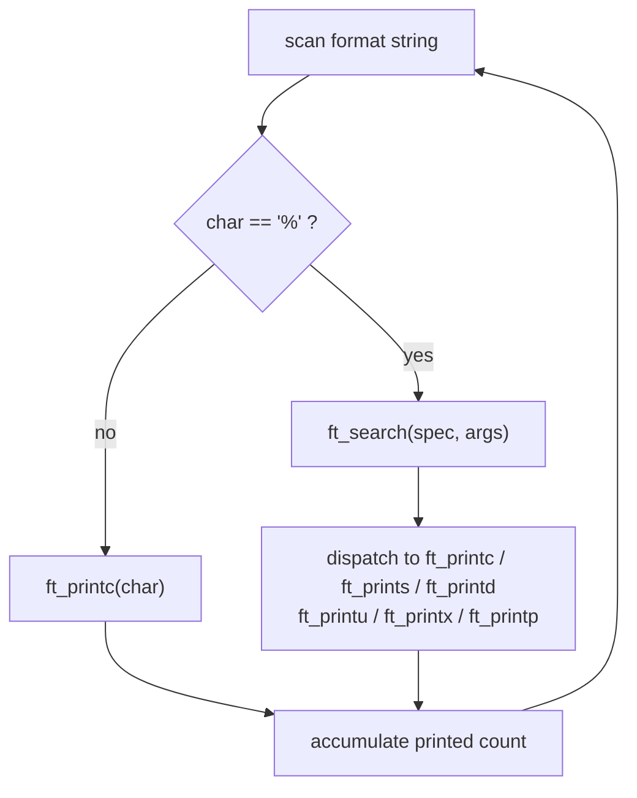

# ft_printf

[← Back to repository overview](../README.md) · [Glossary](../GLOSSARY.md)

A reimplementation of `printf` as a variadic function, built into `libftprintf.a`. It is
vendored into [`mini_talk/printf`](../mini_talk/printf) and
[`so_long/srcs/printf`](../so_long/srcs/printf), which use it for all their output.

## Build

```sh
make          # produces libftprintf.a
make clean / make fclean / make re
```

## API — [`ft_printf.h`](./ft_printf.h)

```c
int	ft_printf(const char *str, ...);
int	ft_printc(char c);
int	ft_prints(const char *str);
int	ft_printd(int n);
int	ft_printu(unsigned int n);
int	ft_printx(unsigned int n, char spec);
int	ft_printp(void *ptr);
```

| Conversion | Meaning |
| ---------- | ------- |
| `%c` | Single character |
| `%s` | Null-terminated string (`(null)` when the pointer is `NULL`) |
| `%d`, `%i` | Signed decimal integer |
| `%u` | Unsigned decimal integer |
| `%x`, `%X` | Unsigned hexadecimal, lower/upper case |
| `%p` | Pointer as `0x`-prefixed hexadecimal (`(nil)` when `NULL`) |
| `%%` | Literal percent sign |

Any other character following `%` is printed literally as `%` followed by that character.

## Control flow — [`ft_printf.c`](./ft_printf.c)



`ft_search` ([`ft_printf.c`](./ft_printf.c)) is the single dispatch point; each helper in
[`func.c`](./func.c) and [`func2.c`](./func2.c) writes with `write(1, ...)` and returns the
number of characters it produced, so `ft_printf` can accumulate and return the total.

Because variadic arguments are consumed in order by `va_arg`, the dispatch must read the
argument of the matching type — reading an `int` for a `%s` would corrupt the whole
remaining argument list.

## Related

- [`libft`](../libft/README.md) — libc reimplementation
- [`get_next_line`](../get_next_line/README.md) — line-by-line reading
